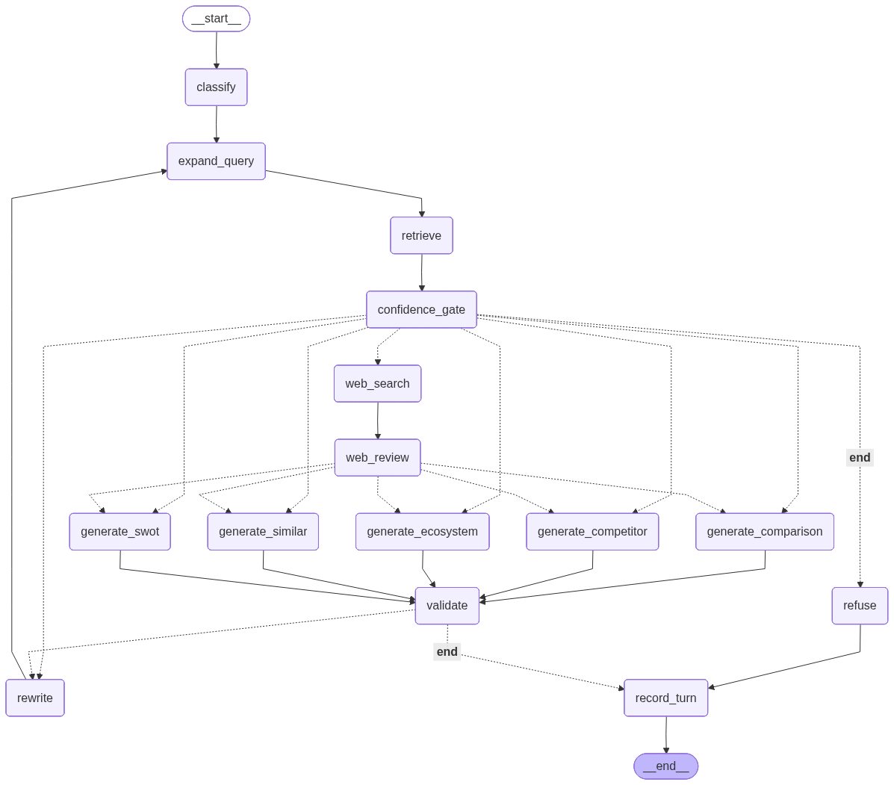

<div align="center">

# 🧠 BizIntel

### AI-Powered Startup Intelligence Engine

[](https://python.org)
[](https://langchain-ai.github.io/langgraph/)
[](https://streamlit.io)
[](https://console.groq.com)
[](https://openai.com)
[](https://www.trychroma.com)
[](LICENSE)

Ask natural-language questions about **134,000+ startups** from Y Combinator & Crunchbase.  
Powered by **LangGraph** orchestration + **Hybrid RAG** — semantic search + BM25 keyword search + cross-encoder reranking + LLM reasoning, with **web fallback**, **human review**, and **persistent conversation memory**.  
**Free to run** — uses Groq's free API by default (switchable to OpenAI).

[Features](#-features) · [Demo](#-demo) · [Quick Start](#-quick-start) · [Architecture](#-architecture) · [Project Structure](#-project-structure) · [Usage](#-usage) · [Tech Stack](#-tech-stack)

</div>

---

## 📸 Demo

<div align="center">


*Streamlit chat interface with sidebar controls, analysis type selector, and 134K indexed startups.*

</div>

---

## ✨ Features

| Feature | Description |
|---|---|
| 🔍 **Similar Startups** | Find companies similar to any startup (e.g., "Find startups similar to Stripe") |
| 📊 **SWOT Analysis** | AI-generated Strengths, Weaknesses, Opportunities, and Threats |
| ⚔️ **Competitor Analysis** | Map the competitive landscape — direct, indirect, differentiators |
| ⚖️ **Side-by-Side Comparison** | Compare startups head-to-head in a structured table |
| 🌐 **Ecosystem Mapping** | Explore an entire industry ecosystem — key players, sub-segments, trends |
| 🤖 **AI Classifier** | LLM-powered query classification — auto-detects the best analysis type |
| 📚 **Source Transparency** | Every answer shows the exact source documents used — no hallucination |
| 🔄 **Query Expansion** | LLM-powered query rewriting for better semantic matching |
| 🗂️ **Dual Vector Store** | Strategy Pattern — swap between ChromaDB and FAISS via config |
| 🔀 **Hybrid Search** | Combines semantic (embedding) + keyword (BM25) search for better recall |
| ⚖️ **Weighted RRF Fusion** | Merges ranked lists with tunable weights (semantic=1.0, BM25=0.4) |
| 🎯 **Cross-Encoder Reranker** | Rescores candidates with `ms-marco-MiniLM-L-6-v2` for +0.13 relevancy gain |
| 🔌 **Multi-Provider LLM** | Switch between Groq (free) and OpenAI (paid) via one config flag |
| 📊 **RAG Evaluation Pipeline** | 30 test queries, 6 metrics (3 LLM-as-Judge + 3 deterministic) |
| 🛡️ **Confidence Guardrails** | Refuses or warns when retrieved context is irrelevant — prevents hallucination |
| 🔗 **LangGraph Orchestration** | Stateful graph pipeline with Classify → Expand → Retrieve → Confidence Gate → Generate → Validate → Rewrite loop |
| ✅ **Post-Gen Validation** | LLM groundedness check after generation — retries with rewritten query on failure |
| 🔁 **Corrective RAG** | Rewrite → re-expand → re-retrieve cycle when confidence is too low or validation fails |
| 🌐 **Web Search Fallback** | If local retrieval exhausts retries, BizIntel can search the open web via Tavily |
| 👁️ **Human-in-the-Loop Review** | Web results pause the graph for user approval before answer generation |
| 💾 **Persistent Conversation Memory** | Multi-turn context is checkpointed by `thread_id` using SQLite-backed LangGraph state |
| ⚡ **Streaming Graph UX** | Streamlit surfaces node-by-node progress, review states, sources, and confidence badges |

---

## 🚀 Quick Start

### Prerequisites

- **Python 3.13+**
- **[uv](https://docs.astral.sh/uv/)** (fast Python package manager)
- **Groq API Key (free)** ([Get one here](https://console.groq.com/keys)) — *or* OpenAI API Key ([paid](https://platform.openai.com/api-keys))
- **Optional Tavily API Key** for web-search fallback ([Get one here](https://app.tavily.com/home))

### 1. Clone & Install

```bash
git clone https://github.com/InsightfulShubh/BizIntel.git
cd BizIntel
uv sync
```

### 2. Set Up Environment

```bash
cp .env.example .env
```

**Option A — Groq (free, default):**
```env
GROQ_API_KEY=gsk_your-groq-key-here
# LLM_PROVIDER=groq  ← already the default in settings.py
```

**Option B — OpenAI (paid):**
```env
OPENAI_API_KEY=sk-your-key-here
LLM_PROVIDER=openai   # override the default
```

**Optional web-search fallback:**
```env
TAVILY_API_KEY=tvly-your-key-here
```

If `WEB_SEARCH_ENABLED=True` but `TAVILY_API_KEY` is missing, BizIntel keeps working and simply disables the web fallback path.

### 3. Run the Data Pipeline

```bash
# Step 1: Clean & unify the raw CSV data (YC + Crunchbase → 134K unified rows)
uv run python -m bizintel.preprocessing.main

# Step 2: Embed all startups & store in vector DB (~20 min on CPU)
uv run python -m bizintel.pipeline.batch_embed --reset
```

### 4. Launch the App

```bash
uv run streamlit run src/bizintel/app/streamlit_app.py --server.port 8501
```

Open **http://localhost:8501** in your browser. 🎉

---

## 🏗️ Architecture

### Offline Pipeline (batch)

```
 CSV Files ──→ Data Cleaning ──→ Document Builder ──→ Embedder
 (YC + CB)     (pandas)          (Pydantic)          (MiniLM-L6)
                   │                                     │
                   ▼                                     ▼
            Unified CSV                          Vector Store
            (134K rows)                     (ChromaDB / FAISS)
                                                     │
                                                     ▼
                                              BM25 Index (in-memory)
```

### Online Pipeline — LangGraph Orchestration

The query pipeline is orchestrated as a **LangGraph StateGraph** with:

- **13 nodes / 2 conditional edges** in local-only mode
- **15 nodes / 3 conditional edges** when web fallback is enabled
- **SQLite-backed checkpointing** in the Streamlit app for multi-turn state and HITL resume



**Graph flow:**

```
START → Classify → Expand Query → Retrieve → Confidence Gate
                                                                                           │
                                      ┌────────────────────────────┼─────────────────────────────┐
                                      ▼                            ▼                             ▼
                             generate_*                  rewrite → loop               web_search / refuse
                        (high/low confidence)         back to expand                 (none after retries)
                                      │                                                          │
                                      ▼                                                          ▼
                               Validate                                                 web_review
                                      │                                                          │
                       ┌────────┴────────┐                                                 ▼
                       ▼                 ▼                                           generate_*
              record_turn      rewrite → loop                                          │
                       │          back to expand                                           ▼
                       ▼                                                               Validate
                      END                                                                 │
                                                                                                                                            ▼
                                                                                                                                 record_turn → END
```

**Nodes (15 with web fallback enabled):**

| Node | Type | Purpose |
|---|---|---|
| `classify` | LLM | Auto-detect analysis type from query |
| `expand_query` | LLM | Rewrite query into rich semantic search terms |
| `retrieve` | Retriever | Hybrid search (semantic + BM25 + RRF + reranker) |
| `confidence_gate` | Logic | Score-based routing: high/low → generate, none → rewrite/refuse |
| `generate_similar` | LLM | Similar startups — ranked list with explanations |
| `generate_swot` | LLM | SWOT analysis — structured 4-quadrant output |
| `generate_competitor` | LLM | Competitive landscape mapping |
| `generate_comparison` | LLM | Side-by-side comparison table |
| `generate_ecosystem` | LLM | Industry ecosystem map & trends |
| `validate` | LLM | Post-generation groundedness check |
| `rewrite` | LLM | Rewrite query for retry (corrective RAG) |
| `refuse` | Logic | Return refusal message when confidence exhausted |
| `web_search` | Tool | Search the open web via Tavily when local retrieval fails |
| `web_review` | HITL | Pause execution and let the user approve/filter web results |
| `record_turn` | Memory | Append the user query and assistant answer into conversation history |

### Key Design Decisions

| Decision | Choice | Why |
|---|---|---|
| **Embedding Model** | `all-MiniLM-L6-v2` (384-dim) | Free, local, fast — no API costs for 134K docs |
| **LLM** | Groq `llama-3.3-70b` (default) / OpenAI GPT-4o-mini | One-flag switch; Groq is free, OpenAI is more grounded |
| **Vector Store** | ChromaDB (default) + FAISS | Strategy Pattern — swap via config, no code changes |
| **Hybrid Search** | Semantic + BM25 keyword search | Catches exact-match terms that embeddings miss |
| **Fusion** | Weighted RRF (sem=1.0, bm25=0.4) | Equal weights regressed relevancy; tuned weights fix it |
| **Reranker** | `ms-marco-MiniLM-L-6-v2` (22 MB) | +0.13 context relevancy gain; only 22 MB, 150ms/query |
| **Guardrails** | Cross-encoder score → confidence gate | Refuse (skip LLM) when score < 0.02; warn when < 0.10. Prevents hallucination on garbage context. |
| **Web Fallback** | Tavily search after retries are exhausted | Expands coverage beyond the local 134K startup dataset |
| **Human Review** | LangGraph `interrupt()` + `Command(resume=...)` | Keeps external web evidence user-approved before generation |
| **Conversation Memory** | SQLite checkpointer + `thread_id` | Follow-up questions survive Streamlit reruns and build on prior turns |
| **Document Format** | Style C (labeled key-value) | Labels act as semantic anchors for the embedding model |
| **Query Expansion** | LLM-based rewriting | Solves the "Stripe → fintech" semantic gap problem |
| **No Chunking** | 1 startup = 1 document | Documents are short (~200 tokens), fit within model limit |
| **Orchestration** | LangGraph StateGraph | Stateful graph with conditional edges, corrective retry loop, web fallback, and HITL pauses |
| **Dependency Injection** | Closure pattern (Option C) | Nodes close over retriever/LLM client; state stays pure serializable data |
| **State Schema** | 3 Pydantic models | InputState / OutputState / PrivateState — clean separation of public API vs internal fields |

---

## 📁 Project Structure

```
BizIntel/
├── src/bizintel/                  # Main package (src-layout)
│   ├── config/
│   │   ├── settings.py            # Centralized config — paths, thresholds, model names
│   │   └── llm_client.py          # LLM client factory — Groq / OpenAI via one flag
│   ├── preprocessing/
│   │   ├── data_preprocess.py     # Load, clean, unify YC + Crunchbase CSVs
│   │   ├── validation.py          # Flag suspicious records (is_suspicious)
│   │   └── main.py                # Pipeline entry point
│   ├── embeddings/
│   │   ├── document_builder.py    # DataFrame → StartupDocument (vectorized)
│   │   └── embedder.py            # SentenceTransformer wrapper with batching
│   ├── vectorstore/
│   │   ├── base.py                # ABC base class + SearchResult + factory
│   │   ├── chroma_store.py        # ChromaDB backend (cosine, HNSW)
│   │   └── faiss_store.py         # FAISS backend (IndexFlatIP + JSON sidecar)
│   ├── search/                    # Keyword search & fusion
│   │   ├── __init__.py
│   │   ├── bm25_search.py         # BM25Okapi index over 134K docs
│   │   └── fusion.py              # Weighted Reciprocal Rank Fusion
│   ├── rag/
│   │   ├── retriever.py           # 5-stage pipeline: semantic → BM25 → RRF → reranker → confidence
│   │   ├── reranker.py            # Cross-encoder reranker → RerankedResults(docs, scores)
│   │   └── prompt_templates.py    # 6 analysis templates + shared base role
│   ├── graph/                     # LangGraph orchestration layer
│   │   ├── state/
│   │   │   ├── input.py           # InputState — public input schema (user_query)
│   │   │   ├── output.py          # OutputState — public output (answer, sources, confidence)
│   │   │   └── private.py         # PrivateState — internal fields (expanded_query, retry_count, memory, web flags)
│   │   ├── nodes/
│   │   │   ├── classify.py        # LLM classifier → analysis_type
│   │   │   ├── expand_query.py    # LLM query rewriter
│   │   │   ├── retrieve.py        # Hybrid retrieval (semantic + BM25 + reranker)
│   │   │   ├── confidence.py      # Score-based confidence gate (pure logic)
│   │   │   ├── generate_similar.py    # Type-specific LLM generation
│   │   │   ├── generate_swot.py
│   │   │   ├── generate_competitor.py
│   │   │   ├── generate_comparison.py
│   │   │   ├── generate_ecosystem.py
│   │   │   ├── _generate_base.py  # Shared generation logic (DRY helper)
│   │   │   ├── validate.py        # Post-gen groundedness check
│   │   │   ├── rewrite.py         # Query rewriter for retry loop
│   │   │   ├── web_search.py      # Tavily web-search fallback node
│   │   │   ├── web_review.py      # HITL review checkpoint for web results
│   │   │   └── record_turn.py     # Append user/assistant turns to graph memory
│   │   ├── edges.py               # Conditional routing functions
│   │   ├── utils/
│   │   │   └── history.py         # Formats recent conversation history for prompts
│   │   └── builder.py             # build_graph() — assembles & compiles the pipeline
│   ├── pipeline/
│   │   └── batch_embed.py         # One-time batch embedding script (CLI)
│   ├── evaluation/
│   │   ├── eval_dataset.py        # 30 test queries with expected domains
│   │   ├── evaluator.py           # LLM-as-Judge + deterministic scorers
│   │   └── run_eval.py            # CLI evaluation runner → JSON + CSV
│   └── app/
│       ├── state.py               # Cached loaders + SQLite checkpointer + Tavily setup
│       ├── components.py          # Sidebar, chat, source cards, CSS
│       └── streamlit_app.py       # Streamlit entry point + streaming status + HITL resume flow
├── notebooks/
│   ├── data_analysis.ipynb        # EDA — 9 visualizations + JSON/Excel export
│   ├── eval_visualization.ipynb   # Evaluation results visualization
│   └── graph_visualization.ipynb  # LangGraph Mermaid viz + smoke tests
├── eval_results/                  # Timestamped eval outputs (JSON + CSV)
├── data-source/                   # Raw CSVs (not in git)
├── data/                          # Cleaned CSVs + vector DB (not in git)
├── docs/
│   ├── langgraph_v2.png                # 🆕 LangGraph pipeline visualization
│   ├── architecture_flowchart.html     # v1 interactive architecture diagram
│   ├── architecture_flowchart_v2.html  # v2 with hybrid search, reranker, Groq
│   ├── architecture_flowchart_v3.html  # v3 confidence guardrails + decision gate
│   ├── interview_prep.html             # 50+ Q&A for interview preparation
│   └── design_decisions_v2.html        # 65+ Q&A — reranker, hybrid, RRF, Groq
├── tests/
│   └── spot_check.py              # Verify real companies in results
├── .env.example                   # Template for API keys (GROQ + OpenAI)
├── .gitignore
├── pyproject.toml                 # Hatch build backend, dependencies
└── .python-version                # Python 3.13
```

---

## 💡 Usage

### Example Queries

| Query | Best Analysis Type |
|---|---|
| *"Find startups similar to Stripe in fintech"* | 🔍 Similar |
| *"SWOT analysis of AI healthcare startups"* | 📊 SWOT |
| *"Who are the main competitors in food delivery?"* | ⚔️ Competitor |
| *"Compare YC edtech vs Crunchbase edtech companies"* | ⚖️ Comparison |
| *"Map the autonomous vehicle startup ecosystem"* | 🌐 Ecosystem |

### Multi-Turn And Web-Fallback Behavior

- Follow-up prompts like "Now do a SWOT for them" reuse prior turns from the same conversation thread.
- If retrieval confidence stays at `none` after retries, the graph can fall back to web search.
- When web fallback is used, the app pauses and asks the user to approve which search results should be used.
- Final responses surface source cards plus a confidence badge derived from graph state.

### CLI Options for Batch Embedding

```bash
# Full index (default: ChromaDB)
uv run python -m bizintel.pipeline.batch_embed --reset

# Quick test with 500 docs
uv run python -m bizintel.pipeline.batch_embed --limit 500 --reset

# Use FAISS backend instead
uv run python -m bizintel.pipeline.batch_embed --backend faiss --reset

# Custom batch size
uv run python -m bizintel.pipeline.batch_embed --batch-size 1000 --reset
```

### Sidebar Controls

| Control | Options | Effect |
|---|---|---|
| **Analysis Type** | Auto-detected by AI classifier | No manual selection — LLM classifies each query |
| **Data Source** | All, YC, Crunchbase | Metadata filter on vector store |
| **Results to Retrieve** | 3–20 (slider) | Number of top-K documents |

---

## 🛠️ Tech Stack

| Layer | Technology | Purpose |
|---|---|---|
| **Language** | Python 3.13 | Runtime |
| **Package Manager** | [uv](https://docs.astral.sh/uv/) + Hatch | Fast installs, PEP 621 build |
| **Data Processing** | pandas, numpy | CSV cleaning, vectorized operations |
| **Validation** | Pydantic v2 | Immutable document models with runtime type checking |
| **Embeddings** | sentence-transformers (`all-MiniLM-L6-v2`) | 384-dim local embeddings |
| **Vector Store** | ChromaDB / FAISS | Cosine similarity search (Strategy Pattern) |
| **Keyword Search** | rank-bm25 (`BM25Okapi`) | TF-IDF keyword matching for hybrid retrieval |
| **Reranker** | cross-encoder (`ms-marco-MiniLM-L-6-v2`) | Pair-wise relevancy rescoring |
| **LLM** | Groq (`llama-3.3-70b-versatile`) / OpenAI (`gpt-4o-mini`) | Grounded analysis generation — free or paid |
| **Web Search** | Tavily | Open-web fallback when the local startup corpus is insufficient |
| **UI** | Streamlit | Chat interface with sidebar controls |
| **Orchestration** | [LangGraph](https://langchain-ai.github.io/langgraph/) 1.1 | StateGraph with conditional routing, interrupts, resume commands, and checkpointing |
| **Checkpointing** | SQLite (`langgraph-checkpoint-sqlite`) | Persistent memory + resume support for HITL flows |
| **Secrets** | python-dotenv | `.env` file for API keys |

---

## 📊 Data Pipeline

```
YC CSVs (2 snapshots)           Crunchbase CSV
       │                              │
       ▼                              ▼
  load_yc_companies()         load_crunchbase_companies()
       │                              │
       ├─ Rename columns              ├─ Filter entity_type = "Company"
       ├─ Parse tags (ast.literal_eval)├─ Description fallback chain
       ├─ Extract first tag → industry ├─ Parse founded_at → year
       └─ _finalize_dataframe()        └─ _finalize_dataframe()
              │                              │
              ▼                              ▼
         YC: 4,399 rows            CB: 129,693 rows
              │                              │
              └──────────┬───────────────────┘
                         ▼
                  pd.concat() → 134,092 unified rows
                         │
                         ▼
                  add_suspicious_flags()
                         │
                         ▼
                  startups_unified.csv
```

### Unified Schema

| Column | Type | Example |
|---|---|---|
| `startup_id` | str | `"yc_12345"` |
| `name` | str | `"Stripe"` |
| `description` | str | `"Stripe builds economic infrastructure..."` |
| `industry` | str | `"fintech"` |
| `tags` | str | `"B2B, SaaS, Payments, API"` |
| `country` | str | `"US"` |
| `founded_year` | Int64 | `2010` |
| `source` | str | `"YC"` or `"Crunchbase"` |

---

## 🔑 Field Selection — Text vs Metadata

> The most critical design decision in any RAG system.

| Field | Embedded Text | Metadata | Rationale |
|---|---|---|---|
| `name` | ✅ | | Semantically meaningful — company names map to domains |
| `industry` | ✅ | | Core semantic signal |
| `tags` | ✅ | | Rich keywords for matching |
| `description` | ✅ | | Richest semantic content |
| `country` | ✅ | ✅ (dual) | Semantic ("Indian startups") + exact filter |
| `founded_year` | ✅ | ✅ (dual) | Semantic ("recent") + range filter |
| `startup_id` | | ✅ | Identifier only |
| `source` | | ✅ | For YC/Crunchbase filtering |
| `is_suspicious` | | ✅ | Quality flag |

---

## 🧪 Design Patterns Used

| Pattern | Where | Why |
|---|---|---|
| **Strategy** | `VectorStoreBase` ABC + ChromaStore/FAISSStore | Swap backends via config |
| **Factory + Closure** | `make_*_node(llm_client)` | Inject dependencies into graph nodes; state stays serializable |
| **Factory** | `create_vector_store(backend)`, `get_llm_client()` | Centralized object creation for stores & LLMs |
| **Dependency Injection** | Retriever, LLM via closures in `build_graph()` | Testable, decoupled — mock LLM client in tests |
| **Immutable Value Object** | `StartupDocument`, `SearchResult` (frozen Pydantic) | Prevent accidental mutation |
| **State Machine** | LangGraph `StateGraph` + conditional edges | Explicit control flow: classify → expand → retrieve → gate → generate → validate |
| **Corrective RAG** | Rewrite → re-expand → re-retrieve loop | `MAX_RETRIES=1` — query is rewritten and re-routed through the full pipeline |
| **Human-in-the-Loop** | `interrupt()` + `Command(resume=...)` in `web_review` | Pause on external evidence, resume only after user approval |
| **Checkpointed Memory** | SQLite `SqliteSaver` + `thread_id` | Persist graph state and conversation history across Streamlit reruns |
| **Template Method** | Prompt templates (shared `_BASE_ROLE`) + `_generate_base.py` | Common generation logic + type-specific prompt selection |
| **Pipeline** | Offline & online data flow | Clear, testable stages |
| **LLM Client Factory** | `config/llm_client.py` → `get_llm_client(provider)` | One-flag swap between Groq (free) and OpenAI (paid) |
| **Circuit Breaker** | Confidence guardrail in `confidence_gate` node | Skip LLM when context is garbage — refuses or retries with rewritten query |

---

## 📈 Performance

| Metric | Value |
|---|---|
| Dataset size | 134,092 startups |
| Embedding time (CPU) | ~21 min |
| Embedding throughput | ~107 docs/sec |
| Vector search latency | ~5ms (ChromaDB HNSW) |
| BM25 search latency | ~30ms |
| RRF fusion latency | ~1ms |
| Reranker latency | ~150ms (cross-encoder, 20 → 5 docs) |
| End-to-end query time | ~2–4s (Groq) / ~3–5s (OpenAI) |
| Embedding dimensions | 384 |
| Index size (ChromaDB) | ~500 MB on disk |
| BM25 index (in-memory) | ~200 MB, builds in ~3s |

---

## 🧪 RAG Evaluation

BizIntel includes a **full evaluation pipeline** using the LLM-as-Judge pattern with 30 test queries across all 6 analysis types.

### 6 Metrics Scored

| # | Metric | Type | What It Measures |
|---|---|---|---|
| 1 | **Context Relevancy** | LLM-as-Judge | Are retrieved docs relevant to the query? |
| 2 | **Groundedness** | LLM-as-Judge | Is every claim in the answer backed by sources? |
| 3 | **Answer Relevancy** | LLM-as-Judge | Does the answer address the user's question? |
| 4 | **Precision@K** | Deterministic | % of retrieved docs matching expected domain keywords |
| 5 | **Structure Score** | Deterministic | Does the answer contain expected sections (e.g., SWOT headings)? |
| 6 | **Bad Result Check** | Deterministic | Did any known-bad results appear? (e.g., "StartupBus" for Stripe query) |

### Run Evaluation

```bash
# Full eval (30 queries — takes ~5-10 min due to LLM calls)
uv run python -m bizintel.evaluation.run_eval

# Quick test (first 5 queries)
uv run python -m bizintel.evaluation.run_eval --limit 5

# Custom output directory
uv run python -m bizintel.evaluation.run_eval --output eval_results
```

### Output

Results are saved as both **JSON** (detailed) and **CSV** (for visualization):

```
eval_results/
├── eval_20260316_143022.json    # Full results + summary + per-type breakdown
└── eval_20260316_143022.csv     # One row per query — ready for pandas/notebook
```

### Example Output

```
══════════════════════════════════════════════════════════════════════
  BizIntel RAG Evaluation — Summary
══════════════════════════════════════════════════════════════════════
  Queries evaluated : 30/30
  Total time        : 312.4s
  Avg latency       : 4.21s per query

  ┌────────────────────────┬─────────┐
  │ Metric                 │  Score  │
  ├────────────────────────┼─────────┤
  │ Context Relevancy      │  0.850  │
  │ Groundedness           │  0.920  │
  │ Answer Relevancy       │  0.890  │
  │ Precision@K            │  0.760  │
  │ Structure Score        │  0.950  │
  │ Bad Result Check       │  1.000  │
  └────────────────────────┴─────────┘
══════════════════════════════════════════════════════════════════════
```

---

## 📝 License

This project is for educational and portfolio purposes.

---

<div align="center">

**Built with ❤️ by [Shubhank Dubey](https://github.com/InsightfulShubh)**

</div>